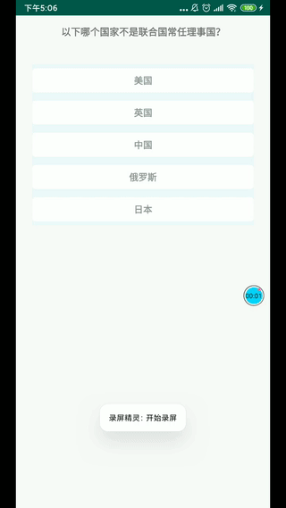

# VoteView
For Android&Java 一款简单易用的投票器 (仿新浪微博)  


### Performance

Sina :


VoteView :




### Usage

Xml :

```bash
 <TextView
        android:layout_width="match_parent"
        android:layout_height="wrap_content"
        android:layout_margin="15dp"
        android:gravity="center"
        android:text="以下哪个国家不是联合国常任理事国？"
        android:textSize="15dp"
        android:textStyle="bold" />

    <com.comjia.library.vote.VoteView
        android:id="@+id/vote_view"
        android:layout_width="match_parent"
        android:layout_height="wrap_content"
        android:layout_margin="25dp"
        android:background="#EEF9FB" />
```


ava


```java
final VoteView voteView = findViewById(R.id.vote_view);

        LinkedHashMap<String, Integer> voteData = new LinkedHashMap<>();
				//造数据源
        voteData.put("美国", 0);
        voteData.put("英国", 15);
        voteData.put("中国", 3);
        voteData.put("俄罗斯", 33);
        voteData.put("日本", 99);

        voteView.initVote(voteData);
        voteView.setAnimationRate(600);
        voteView.setVoteListener(new VoteListener() {
            @Override
            public boolean onItemClick(View view, int index, boolean status) {
                if (!status) {
                    showDialog(voteView, view);//投票取消 dialog 处理详见 Sample MainActivity
                } else {
                    voteView.notifyUpdateChildren(view, true);
                }
                return true;
            }
        });
```


### API


| 序号 | 方法名               | 描述                                                         |
| ---- | -------------------- | ------------------------------------------------------------ |
| 1    | initVote             | 初始化投票器包含数据和投票器子 view 的初始化                 |
| 2    | setVoteListener      | 设置投票器监听, 当前包含 子view 、index 、status 选中状态三个回调 |
| 3    | setAnimationRate     | 设置投票器投票状态时执行动画速率 speed 取值范围 100毫秒 - 5000毫秒 |
| 4    | resetNumbers         | 恢复初始各条目投票数目设置，配合选中 numbers 数默认 + 1 使用 |
| 5    | notifyUpdateChildren | 通知投票器变更投票或者未投票状态                             |


### TODO

 待对外暴露的接口 & 优先级

- 设置投票子 view 的上下 margin  p0

- 进度条的正反选颜色 p0

- 文字数字和边框线的颜色 p0

- 设置 Unit 单位接口，如: 人 、万人 p0 

- 选中小 icon 的设置 p0

- 投票后 content 居左 margin 设置 p1 

- 投票后 number 居右 margin 设置 p1 

- 边框线粗细 圆角 p1 

- 回未投票状态时候是否展示平移动画 p2 

- 字体大小设置 p2

- 选中子 view 的 number 是否需要默认加 1  p2 

  